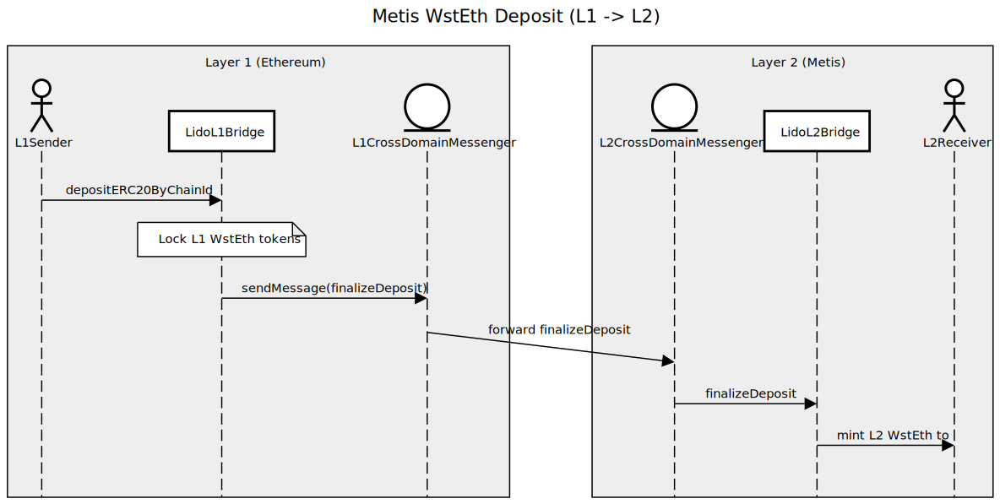
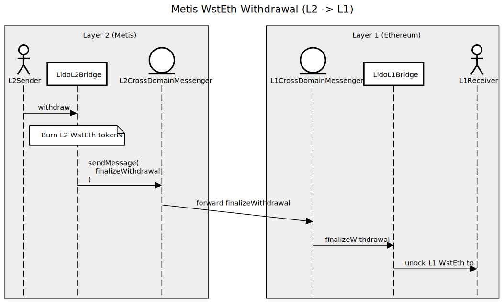

# lido-metis-bridge

This document details the implementation of the bridging of the ERC20 compatible tokens between Ethereum and Metis chains in order to be used by Lido.

The implementation highly rely on the bridging methodology provided by Lido to integrate Optimism [here](https://github.com/lidofinance/lido-l2/tree/main/contracts/optimism). 
The aim is to build the same functionality for Metis taking into account the differences between the bridges on the two networks.

We use the same approach such that instead of using Metis StandardBridge, we develop a bridge for Lido using `IL1ERC20Bridge` and `IL2ERC20Bridge` interfaces.

## Metis bridge flow:

The default implementation of the Metis bridging solution consists of two parts: `L1StandardBridge` and `L2StandardBridge`. These contracts allow bridging the ERC20 tokens between Ethereum and Metis chains.

In the standard bridge, when ERC20 is deposited on L1 and transferred to the bridge contract it remains "locked" there while the equivalent amount is minted in the L2 token. For withdrawals, the opposite happens the L2 token amount is burned then the same amount of L1 tokens is transferred to the recipient.

The default Metis bridge is suitable for the short-term goal of the Lido (bridging of the wstETH token into Metis), but it complicates the achievement of the long-term goals. For example, implementation of the staking from L2's very likely will require extending the token and gateway implementations.

Additionally, Metis provides functionality to implement the custom bridge solution utilizing the same cross-domain infrastructure as the standard bridge. The only constraint for the custom bridge to be compatible with the default Metis Gateway is the implementation of the `IL1ERC20Bridge` and `IL2ERC20Bridge` interfaces.

The rest of the document provides a technical specification of the bridge Lido will use to transfer tokens between Ethereum and Metis chains.

## Lido Bridge flow:

This part presents an overview of the solution suggested by Lido. The description below is taken as is from the [link](https://github.com/lidofinance/lido-l2/tree/main/contracts/optimism).


* BridgingManager - contains administrative methods to retrieve and control the state of the bridging process.
* BridgeableTokens - contains the logic for validation of tokens used in the bridging process.
* CrossDomainEnabled - helper contract for contracts performing cross-domain communications
* L1ERC20TokenBridge - Ethereum's counterpart of the bridge to bridge registered ERC20 compatible tokens between Ethereum and Metis chains.
* L2ERC20TokenBridge - Metis' counterpart of the bridge to bridge registered ERC20 compatible tokens between Ethereum and Metis chains
* ERC20Bridged - an implementation of the ERC20 Permit token with administrative methods to mint and burn tokens.
* OssifiableProxy - the ERC1967 proxy with extra admin functionality.

### Governance

Optimism Bridge Executor provided by AAVE is used for Metis. Optimism Bridge Executor on L2 stores the actions to be executed in a queue, and is only accessible by L1 Lido agent.

<p align="center">
  
</p>

### Deposits and withdrawals

Users can deposit (transfer WstETH from L1 to L2) using `L1LidoBridge.depositERC20ByChainId` or `L1LidoBridge.depositERC20ToByChainId`. Their L1 WstETH will be locked on the bridge. `L1LidoBridge` sends a message to `L2LidoBridge` (calling `finalizeDeposit`) using Metis' `L1CrossDomainMessenger` and `L2CrossDomainMessenger` to mint new WstETH to the receiver on L2.

<p align="center">
    
</p>


Users can withdraw (transfer WstETH from L2 to L1) using `L2LidoBridge.withdraw` or `L2LidoBridge.withdrawTo`. Their WstETH on L2 will be burned. `L2LidoBridge` sends a message to `L1LidoBridge` using Metis' `L1CrossDomainMessenger` and `L2CrossDomainMessenger` to release the locked WstETH tokens to the receiver on L1.

<p align="center">
    
</p>

## Tests

The tests are similar to the ones for Optimism. Please refer to repo's main readme for details. One important difference is that in managing deposits, executor, and proxy tests, aragon agent aren't used. Instead the tests use a mock contract `AragonAgentMock` which simply executes some action on an a smart contract with some value and calldata using the function `function execute(address _target, uint256 _ethValue, bytes calldata _data)`

The env variables that need to be filled for each type of tests/deployment can be found in `.env.wsteth.mts_sepolia` and `.env.wsteth.mts_mainnet`. You can also use the main readme file of the repository. 

```
npm run metis:test:unit
npm run metis:test:integration
npm run metis:test:acceptance
npm run metis:test:executor
npm run metis:test:launch
```

> ℹ️ The time [Metis Sepolia State Commitment Chain](https://sepolia.etherscan.io/address/0x9DCC53737FcB3E86a17CF435ca3c15390D4FC7Ed) takes to submit a new state batch may go up to six hours. The messages can't be relayed without its state being on L1. After the state batch is appended on L1, the message should be outside the fraud proof window to be relayed. This takes one hour on Sepolia and 7 days on mainnet. Thus running the withdrawal (L2 -> L1) flow `test/metis/bridging.e2e.test` and `test/metis/bridging-to.e2e.test` on Sepolia may take seven hours and around 7 days on mainnet. You can check the status of mainnet State Commitment Chain [here](https://etherscan.io/address/0xA2FaAAC9120c1Ff75814F0c6DdB119496a12eEA6). The script `metis:finalize-message` relays an L2 transaction given its hash as an env variable: `TX_HASH`.

> On the other hand, deposit (L1 -> L2) flow takes couple of minutes on both testnet and mainnet.

## Questionnaire

| Recommendation                               | Is satisfied?    | Comment |
| -------------------------------------------- | ---------------- | ------- |
| Has wstETH been bridged?                     | No ❌ ||
| If bridged, how much adoption token has got? |-|-|
| R-1: Audited code and verifiable deployment  | Not yet ⏳ ||
| R-2: Lock-and-mint bridge mechanics          | Yes ✅ ||
| R-3: Usage of canonical bridge               | Yes ✅ |         |
| R-4: L2 wstETH token upgradable              | Yes ✅ |         |
| R-5: Bridging L1 Lido DAO decisions          | Yes ✅ ||
| R-6: Dedicated upgradable bridge instances   | Yes ✅ ||
| R-7: Pausable deposits and withdrawals       | Yes ✅ | Deposits/withdrawals disabler role will be granted to Lido DAO and Emergancy Brakes multi-sigs on both networks. |
| R-8: ERC-2612 permit enhanced with EIP-1271  | Yes ✅ |         |
| R-9: Token/bridge state before snapshot vote | TBD ⏳ |         |
| R-10: Upgradability mechanics                | Yes ✅ |         |
| R-11: Use AccessControlEnumerable for ACL    | Yes ✅ |         |
| R-12: Share the deploy artifacts             | TBD ⏳ |         |
| R-13: No same contract addresses             | TBD ⏳ |          |


## Differences between Optimism and Metis bridges
Since the Metis hard fork, there have been significant alterations to the bridge associated with Optimism. However, the last commit on the bridges in Metis was on Dec 2022. The current bridge structure in Metis resembles to an earlier version used by Optimism. For detailed insights into Optimism's bridge implementation, now implemented by Metis, refer to this tutorial: [Optimism Standard Bridge Annotated Code](https://ethereum.org/en/developers/tutorials/optimism-std-bridge-annotated-code/).

The main change is that the bridges on Metis contain additional functions (and events) for handling the deposits and withdrawal with one more parameter and that is the chain id. This enables the Ethereum-Metis bridge to be compatibale with many networks at the same time. Another difference is sending transaction functions cross domain in Metis requires a value on the native token.

### Technical details

Metis has added payable in the initiate withdrawal method, which can collect metis in L2 to pay the gas fee of the message relayer in L1. The gas fee is set by `OVM_GasPriceOracle.minErc20BridgeCost` and can be adjusted.

#### IL1ERC20Bridge
**Addtional features:**:

1. New event ERC20ChainID: `event ERC20ChainID(uint256 _chainid);`

2. New function `depositERC20ByChainId`: 
    ```
    function depositERC20ByChainId (
        uint256 _chainid,
        address _l1Token,
        address _l2Token,
        uint _amount,
        uint32 _l2Gas,
        bytes calldata _data
    )
        external payable;
    ```

3. New function `depositERC20ToByChainId`:
    ```
    function depositERC20ToByChainId (
        uint256 _chainid,
        address _l1Token,
        address _l2Token,
        address _to,
        uint _amount,
        uint32 _l2Gas,
        bytes calldata _data
    )
        external payable;
    ```

4. New function `finalizeERC20WithdrawalByChainId`:
    ```
    function finalizeERC20WithdrawalByChainId (
        uint256 _chainid,
        address _l1Token,
        address _l2Token,
        address _from,
        address _to,
        uint _amount,
        bytes calldata _data
    )
        external;
    ```

5. New function `finalizeMetisWithdrawalByChainId`:
    ```
    function finalizeMetisWithdrawalByChainId (
        uint256 _chainid,
        address _from,
        address _to,
        uint _amount,
        bytes calldata _data
    )
        external;
    ```

#### L1ERC20TokenBridge

The function `_initiateERC20DepositByChainId` requires having a minimum gas retrieved from the oracle. It also supports discounts. The
function acts differently if the L1 token is Metis or not (this is to handle Metis which is an ERC20 token on both Ethereum and Metis).

#### IL2ERC20Bridge

**Existing functions changes:**

1. The function `withdraw` is payable in Metis but it's nonpayable in Optimism. 
2. The function is `withdrawTo` is payable in Metis but it's nonpayable in Optimism. 

#### L1ERC20TokenBridge

The function `_initiateWithdrawal` requires minimum L1 gas. The function acts differently if the L2 token is Metis. 

#### ICrossDomainMessenger

**Addtional features:**:
1. New function `sendMessageViaChainId`:
```
    function sendMessageViaChainId(
        uint256 _chainId,
        address _target,
        bytes calldata _message,
        uint32 _gasLimit
    ) external payable;
```

**Existing functions changes:**
1. The function `sendMessage` is payable in Metis but it's nonpayable in Optimism.

## Optimism-Metis integration
This part addresses the changes between the two networks. Simply put, for the additional functions, we grab the implementation provided by Metis in the [MVM repository](https://github.com/MetisProtocol/mvm/tree/develop/packages/contracts/contracts).

**Metis token functionality dropped:**
- In Metis' `L1StandardBridge` contract, the function `_initiateERC20DepositByChainId` encodes the message differntly based on whether the L1 token is Metis or not. We removed this part in the Lido bridge, as the bridge is not supposed to handle Metis tokens. This saves gas as well. 

- The funciton `finalizeMetisWithdrawalByChainId` in `L1ERC20TokenBridge` was not implemented. Calling this function will revert with `ErrorNotImplemented`. 

- The functions `withdrawMetis`, `withdrawMetisTo` in `L2ERC20TokenBridge` were not implemented. Calling these functions will revert with `ErrorNotImplemented`. 

- The function `finalizeDeposit` in `L2ERC20TokenBridge`, we don't verify the deposited token on L1 matches the L2 deposited token representation. This is done in `L2StandardBridge` in Metis.
